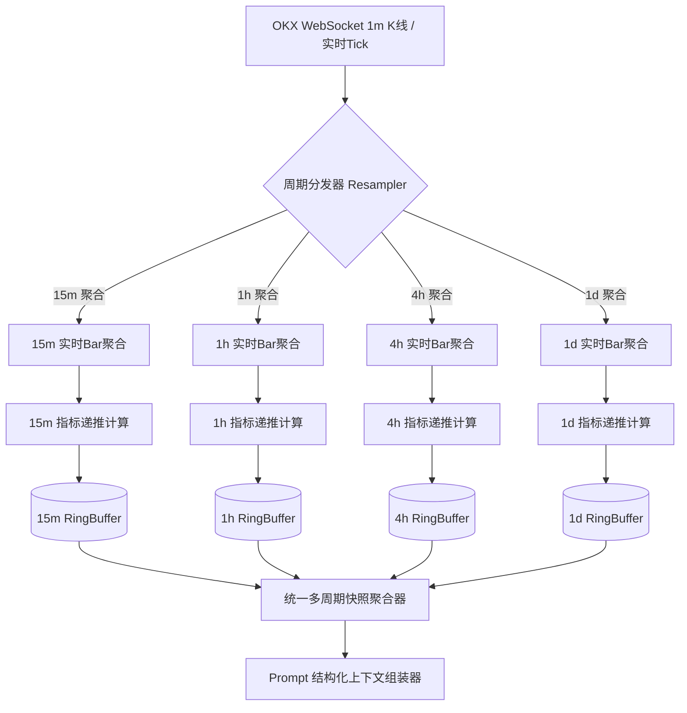
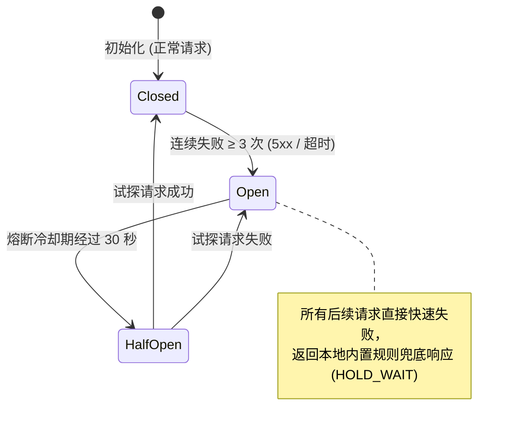
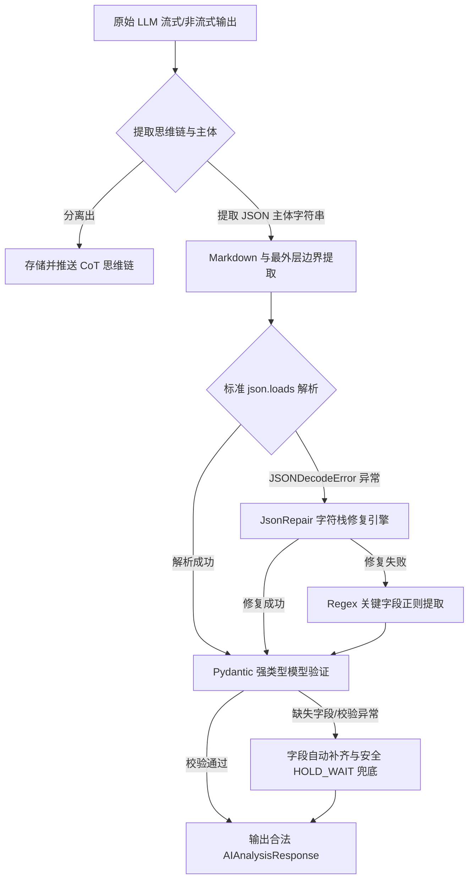
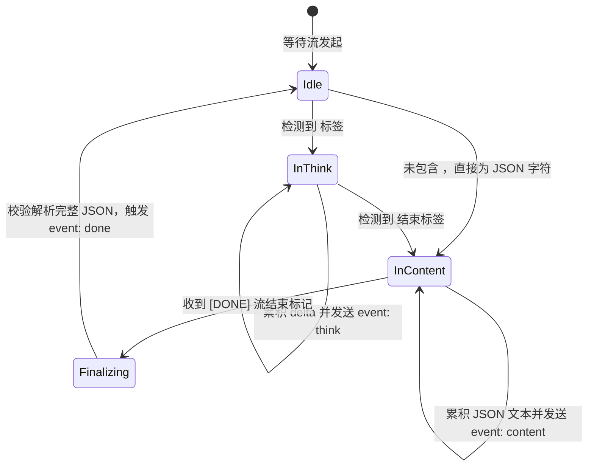
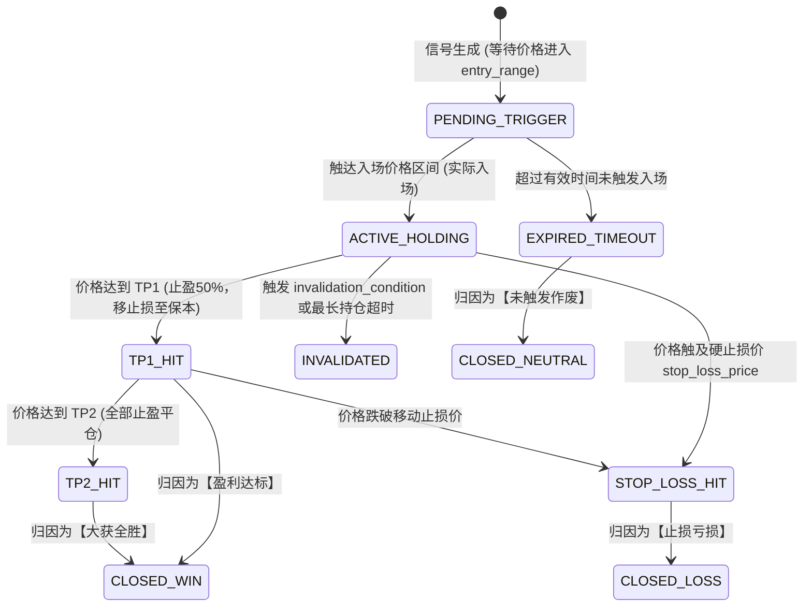

# OKX-Dog AI 量化指标引擎与大模型决策中枢架构设计
## Technical Architecture Specification: `okx-dog-ai` (v1.0.0)

---

## 1. 架构总览与系统定位

`okx-dog-ai` 是 OKX-Dog 系统的**量化感知与大模型决策中枢**。其核心使命是消除加密货币交易中的情绪偏见，通过微秒/毫秒级量化指标增量计算流水线、结构化上下文组装与动态 Token 裁剪算法，结合兼容 OpenAI 标准协议的顶级大语言模型（如 DeepSeek-R1/V3, GPT-4o, Claude 3.5 Sonnet, Qwen-2.5 等），实现金融级的多周期行情共振研判、精准点位规划及严密的事后胜率归因。

```
┌──────────────────────────────────────────────────────────────────────────┐
│                           OKX-Dog AI 核心架构                            │
├──────────────────────────────┬───────────────────────────────────────────┤
│   1. 量化指标与微观流引擎    │   2. 结构化上下文与Token裁剪              │
│   ┌────────────────────────┐ │   ┌─────────────────────────────────────┐ │
│   │ 增量 K线 Resampling    │ │   │ P0/P1/P2/P3 优先级分层过滤          │ │
│   │ EMA/MACD/RSI/BB/ATR    │ │   │ 浮点精度动态压缩与紧凑序列化        │ │
│   │ 衍生品(FR/OI/LS-Ratio) │ │   │ 预算感知裁剪 (Dynamic Budgeting)    │ │
│   └────────────────────────┘ │   └─────────────────────────────────────┘ │
├──────────────────────────────┼───────────────────────────────────────────┤
│   3. OpenAI 标准兼容网关     │   4. 容错解析与结构化输出契约 (JSON Schema)│
│   ┌────────────────────────┐ │   ┌─────────────────────────────────────┐ │
│   │ 多模型统一参数适配器   │ │   │ 强制 JSON Schema 约束               │ │
│   │ 连接池与退避熔断机制   │ │   │ 多层 Regex/JsonRepair 容错自愈      │ │
│   │ SSE 流式分发 (<think>) │ │   │ Pydantic 校验与安全策略兜底         │ │
│   └────────────────────────┘ │   └─────────────────────────────────────┘ │
├──────────────────────────────┴───────────────────────────────────────────┤
│   5. 研判生命周期与 MFE/MAE 胜率归因闭环                                 │
│   ┌────────────────────────────────────────────────────────────────────┐ │
│   │ 状态机流转 (PENDING -> ACTIVE -> TP/SL/EXPIRED)                   │ │
│   │ MFE / MAE 最大有利/不利偏移量化评估                                │ │
│   │ Prompt 胜率归因报表与动态 Few-Shot 自适应反哺                      │ │
│   └────────────────────────────────────────────────────────────────────┘ │
└──────────────────────────────────────────────────────────────────────────┘
```

---

## 2. 多周期技术指标与衍生品实时计算流水线

### 2.1 指标计算范围与数学模型

为满足不同周期的量化特征提取，系统实时维护 4 个核心周期：`15m`、`1h`、`4h`、`1d`。

| 指标名称 | 参数配置 | 算法原理 | 输出特征 |
| :--- | :--- | :--- | :--- |
| **EMA** (指数移动平均) | 20, 50, 200 | $\alpha = \frac{2}{N+1}$, $EMA_t = \alpha P_t + (1-\alpha) EMA_{t-1}$ | 趋势排列（多头/空头/粘合）、均线倾角、动态支撑阻力 |
| **MACD** (异同移动平均线) | Fast=12, Slow=26, Signal=9 | $DIF = EMA_{12} - EMA_{26}$, $DEA = EMA_9(DIF)$, $HIST = (DIF - DEA) \times 2$ | 零轴上下位置、金叉/死叉、红绿柱动能背离 |
| **RSI** (相对强弱指标) | Period=14 | Wilder's Smoothing: $RS = \frac{SMMA(Gain, 14)}{SMMA(Loss, 14)}$, $RSI = 100 - \frac{100}{1+RS}$ | 超买 (>70)、超卖 (<30)、顶背离/底背离 |
| **Bollinger Bands** | Period=20, Std=2.0 | $Middle = SMA_{20}$, $Upper = Middle + 2\sigma$, $Lower = Middle - 2\sigma$ | 带宽百分比 Bandwidth%、价格相对位置 %B、挤压突破 |
| **ATR** (真实波幅) | Period=14 | $TR_t = \max(H_t-L_t, |H_t-C_{t-1}|, |L_t-C_{t-1}|)$, $ATR_t = \frac{ATR_{t-1}\times 13 + TR_t}{14}$ | 市场绝对波动率、动态止损乘数锚点 |
| **Volume Profile** | 最近 50 根 K 线 | 价格区间成交量加权分布 | POC (控制点/成交密集区)、VAH (价值区高点)、VAL (价值区低点) |
| **资金费率 (FR)** | 实时推送 (8h周期) | OKX 资金费率与倒计时 | 偏离度评分、套利多空成本 |
| **持仓量 (OI)** | 实时推送 + 24h变化 | 全网未平仓合约量 (Open Interest) | 主力资金建仓/平仓/轧空研判 |
| **多空持仓比** | 实时推送 | 账户多空比与大户账户比 | 散户拥挤度与主力反向意图 |
| **深度失衡比** | Top 20 档盘口 | $Imbalance = \frac{\sum_{i=1}^{20} Q_{bid,i}}{\sum_{i=1}^{20} Q_{ask,i}}$ | 瞬时微观买卖盘厚度倾斜 |

---

### 2.2 增量递推更新与 Welford 在线方差算法

在毫秒级高频行情下，若每收到一笔 Tick 重新对全量历史 K 线执行 $O(N)$ 计算会导致 CPU 爆炸。本引擎采用 **$O(1)$ 增量递推算法**：

#### 1. EMA 增量更新
当当前 K 线的最新价格 $P_{curr}$ 变动时（K线尚未闭合）：
$$EMA_{curr} = \alpha \cdot P_{curr} + (1 - \alpha) \cdot EMA_{prev\_closed}$$
其中 $\alpha = \frac{2}{N+1}$。$EMA_{prev\_closed}$ 为上一根已闭合 K 线的确定值。

#### 2. 布林带 (Bollinger Bands) 的 Welford 滑动窗口算法
利用滑动窗口的 Welford 算法在 $O(1)$ 时间内维护均值 $\mu$ 与样本方差 $\sigma^2$：
- 设滑动窗口大小为 $W=20$；
- 移除滑出窗口的老数据 $x_{old}$，加入新数据 $x_{new}$：
$$\mu_{new} = \mu_{old} + \frac{x_{new} - x_{old}}{W}$$
$$\sigma^2 = \frac{1}{W}\sum_{i=1}^W (x_i - \mu_{new})^2$$
通过维护 $\sum x_i$ 和 $\sum x_i^2$ 两个累加器实现毫秒级无损更新。

#### 3. ATR 增量更新
$$TR_{curr} = \max(High_{curr} - Low_{curr}, |High_{curr} - Close_{prev}|, |Low_{curr} - Close_{prev}|)$$
$$ATR_{curr} = \frac{ATR_{prev\_closed} \times (14 - 1) + TR_{curr}}{14}$$

---

### 2.3 内存环形缓冲区 (Circular Ring Buffer) 与多周期重采样

系统在内存中为每个交易对的每个周期维护定长 `CircularBuffer`：

```python
# 环形缓冲区内存规划与容量设计
RING_BUFFER_CAPACITIES = {
    "15m": 500,   # 覆盖约 5.2 天行情
    "1h":  500,   # 覆盖约 20.8 天行情
    "4h":  300,   # 覆盖约 50 天行情
    "1d":  250    # 覆盖约 250 天（约 8 个月）宏观趋势
}
```



---

## 3. 行情上下文组装算法与动态 Token 裁剪 (Dynamic Token Budgeting)

大语言模型的推理延迟与成本直接受 Prompt Token 长度影响，过长的上下文还会引发注意力分散与幻觉。系统设计了**优先级分级与动态 Token 预算裁剪算法**。

### 3.1 字段优先级分级 (Priority Hierarchy)

| 优先级 | 数据类别 | 包含字段 | 保护规则 |
| :--- | :--- | :--- | :--- |
| **P0 (Critical)** | 交易核心要素 | 标的代码、最新标记价、24h涨跌幅、当前账户持仓状态、硬风控额度上限、4H主趋势与关键供需区 | **绝对不可裁剪**，必须完整保留 |
| **P1 (High)** | 核心技术指标 | 15M/1H EMA排列、1H MACD/RSI、15M ATR、资金费率及结算倒计时、OI 24h变动 | 保留核心数值，保留 2 位小数 |
| **P2 (Medium)** | 宏观与情绪指标 | 1D EMA200 宏观位置、多空持仓人数比、布林带上下轨数值 | 若超过 Token 预算，可压缩描述语句或精简输出 |
| **P3 (Low)** | 盘口微观流水 | 盘口买卖前 5 档明细、近期单笔大单明细 | 默认仅提取失衡率 (Imbalance Ratio)，档位列表仅在异动触发时按需加载 |

---

### 3.2 动态裁剪与格式压缩算法伪代码

```python
class DynamicContextCompressor:
    def __init__(self, max_token_budget: int = 1500):
        self.max_token_budget = max_token_budget

    def compress_market_snapshot(self, raw_snapshot: dict, user_budget_tokens: int = None) -> dict:
        budget = user_budget_tokens or self.max_token_budget
        
        # 1. 提取 P0 核心数据 (强制保留)
        compressed = {
            "symbol": raw_snapshot["symbol"],
            "price": round(raw_snapshot["current_price"], 2 if raw_snapshot["current_price"] > 10 else 4),
            "change_24h": f"{raw_snapshot['change_24h_pct']:+.2f}%",
            "active_pos": self._format_position(raw_snapshot.get("active_position")),
            "risk_limits": raw_snapshot["risk_limits"],
            "tf_4h": {
                "trend": raw_snapshot["indicators"]["4h"]["trend"],
                "support": raw_snapshot["indicators"]["4h"]["key_support"],
                "resistance": raw_snapshot["indicators"]["4h"]["key_resistance"]
            }
        }
        
        # 2. 提取 P1 核心指标
        compressed["tf_1h"] = {
            "ema_status": raw_snapshot["indicators"]["1h"]["ema_alignment"],
            "rsi": round(raw_snapshot["indicators"]["1h"]["rsi"], 1),
            "macd": raw_snapshot["indicators"]["1h"]["macd_signal"]
        }
        compressed["tf_15m"] = {
            "rsi": round(raw_snapshot["indicators"]["15m"]["rsi"], 1),
            "atr": round(raw_snapshot["indicators"]["15m"]["atr"], 2),
            "bb_pos": raw_snapshot["indicators"]["15m"]["bb_position"]
        }
        compressed["derivatives"] = {
            "funding_rate": f"{raw_snapshot['funding_rate'] * 100:.4f}%",
            "oi_delta_24h": f"{raw_snapshot['oi_change_24h_pct']:+.2f}%",
            "ls_ratio": round(raw_snapshot["long_short_account_ratio"], 2)
        }
        
        # 3. 评估当前估算 Token (以字符长度 / 3.5 快速估算)
        estimated_tokens = len(str(compressed)) // 3.5
        
        # 4. 若预算充裕，追加 P2 / P3 (1D 宏观与盘口前5档)
        if estimated_tokens + 300 <= budget:
            compressed["tf_1d"] = {
                "macro_trend": raw_snapshot["indicators"]["1d"]["macro_trend"],
                "ema200": raw_snapshot["indicators"]["1d"]["ema200"]
            }
            if raw_snapshot.get("is_anomaly_mode"):
                compressed["orderbook_imbalance"] = round(raw_snapshot["imbalance_ratio"], 2)
                compressed["top_bids"] = raw_snapshot["orderbook_bids"][:3]
                compressed["top_asks"] = raw_snapshot["orderbook_asks"][:3]
                
        return compressed
```

---

## 4. OpenAI 标准接口兼容网关设计

系统构建了一个高可用、统一抽象的 LLM 网关，无需为每个大模型供应商编写专有代码，通过标准的 OpenAI SDK 与 HTTP 适配层无缝对接。

### 4.1 多模型统一参数适配器

不同供应商的参数细节存在差异（如 OpenAI 使用 `max_completion_tokens`，DeepSeek 与 Qwen 使用 `max_tokens`，DeepSeek-R1 支持思维链 `<think>`，OpenAI o1 使用 `reasoning_effort`）。网关层统一进行参数抹平：

```python
class LLMModelAdapter:
    @staticmethod
    def adapt_request_payload(
        model_name: str,
        messages: list,
        temperature: float,
        max_tokens: int,
        response_schema: dict = None,
        stream: bool = True
    ) -> dict:
        payload = {
            "model": model_name,
            "messages": messages,
            "stream": stream
        }
        
        # 模型特异性参数映射
        is_o_series = model_name.startswith("o1") or model_name.startswith("o3")
        is_deepseek_reasoner = "reasoner" in model_name or "r1" in model_name.lower()
        
        if is_o_series:
            # o1/o3 不支持自定义 temperature，且使用 max_completion_tokens
            payload["max_completion_tokens"] = max_tokens
            payload["reasoning_effort"] = "medium"
        elif is_deepseek_reasoner:
            # DeepSeek-R1 支持 max_tokens，temperature 建议设为 0.6
            payload["temperature"] = temperature if temperature is not None else 0.6
            payload["max_tokens"] = max_tokens
        else:
            payload["temperature"] = temperature
            payload["max_tokens"] = max_tokens

        # Structured Outputs 结构化输出支持
        if response_schema:
            payload["response_format"] = {
                "type": "json_schema",
                "json_schema": {
                    "name": "OKXDogAIAnalysisResponse",
                    "strict": True,
                    "schema": response_schema
                }
            }
            
        return payload
```

---

### 4.2 异步连接池、重试与熔断降级机制 (Circuit Breaker)

网关使用 `httpx.AsyncClient` 维护连接池，并具备指数退避带抖动 (Exponential Backoff with Jitter) 与熔断状态机：



---

## 5. Structured Outputs (JSON Schema) 强制约束与容错解析方案

在生产环境中，并非所有模型或三方代理均完美支持 OpenAI 的 `strict: true` 模式。为确保系统 100% 具备生产可用性，系统设计了**五层容错与自愈解析流水线**：



### 5.1 容错修复引擎核心实现代码骨架

```python
import json
import re
import uuid
from typing import Dict, Any, Tuple
from pydantic import ValidationError

class RobustJSONParser:
    @classmethod
    def extract_think_and_content(cls, raw_text: str) -> Tuple[str, str]:
        """分离思维链 <think>...</think> 与有效 JSON 文本"""
        think_match = re.search(r"<think>(.*?)</think>", raw_text, re.DOTALL)
        think_content = think_match.group(1).strip() if think_match else ""
        clean_content = re.sub(r"<think>.*?</think>", "", raw_text, flags=re.DOTALL).strip()
        return think_content, clean_content

    @classmethod
    def repair_and_parse(cls, text: str) -> Dict[str, Any]:
        """多层级自愈解析"""
        _, content = cls.extract_think_and_content(text)
        
        # 1. 尝试去除 Markdown 代码块包裹
        if "```json" in content:
            content = content.split("```json")[1].split("```")[0].strip()
        elif "```" in content:
            content = content.split("```")[1].split("```")[0].strip()
            
        # 2. 提取最外层的大括号
        start_idx = content.find("{")
        end_idx = content.rfind("}")
        if start_idx != -1 and end_idx != -1 and end_idx > start_idx:
            content = content[start_idx:end_idx + 1]

        # 3. 第一层尝试：直接标准解析
        try:
            return json.loads(content)
        except json.JSONDecodeError:
            pass

        # 4. 第二层尝试：常见语法错误修复 (Trailing commas, unclosed quotes)
        content_fixed = re.sub(r",\s*([\]}])", r"\1", content) # 移除末尾多余逗号
        content_fixed = re.sub(r"//.*?\n", "\n", content_fixed) # 移除单行注释
        try:
            return json.loads(content_fixed)
        except json.JSONDecodeError:
            pass

        # 5. 第三层尝试：字符栈暴力闭合修复
        repaired = cls._stack_repair(content_fixed)
        try:
            return json.loads(repaired)
        except json.JSONDecodeError:
            pass

        raise ValueError(f"无法解析的 JSON 格式: {content[:100]}...")

    @staticmethod
    def _stack_repair(s: str) -> str:
        """基于字符栈自动闭合未匹配的大括号与中括号"""
        stack = []
        in_string = False
        escape = False
        for char in s:
            if char == '"' and not escape:
                in_string = not in_string
            elif not in_string:
                if char in "{[":
                    stack.append(char)
                elif char == "}" and stack and stack[-1] == "{":
                    stack.pop()
                elif char == "]" and stack and stack[-1] == "[":
                    stack.pop()
            escape = (char == "\\" and not escape)
            
        # 补齐未闭合的括号
        while stack:
            top = stack.pop()
            s += "}" if top == "{" else "]"
        return s

    @classmethod
    def fallback_safe_response(cls, symbol: str, error_msg: str) -> Dict[str, Any]:
        """当发生不可恢复解析错误时的绝对安全兜底契约"""
        return {
            "analysis_id": str(uuid.uuid4()),
            "symbol": symbol,
            "timestamp": int(1755216000000),
            "market_regime": "RANGING",
            "timeframe_analysis": {
                "tf_15m": {"trend": "NEUTRAL_CHOPPY", "key_indicators_summary": "解析降级兜底", "support_level": 0.0, "resistance_level": 0.0},
                "tf_1h": {"trend": "NEUTRAL_CHOPPY", "key_indicators_summary": "解析降级兜底", "support_level": 0.0, "resistance_level": 0.0},
                "tf_4h": {"trend": "NEUTRAL_CHOPPY", "key_indicators_summary": "解析降级兜底", "support_level": 0.0, "resistance_level": 0.0},
                "tf_1d": {"trend": "NEUTRAL_CHOPPY", "key_indicators_summary": "解析降级兜底", "support_level": 0.0, "resistance_level": 0.0}
            },
            "derivatives_sentiment": {
                "funding_rate_bias": "NEUTRAL",
                "open_interest_interpretation": "数据流降级，维持中性",
                "long_short_ratio_state": "中性",
                "sentiment_score": 0.0
            },
            "signal": {
                "action": "HOLD_WAIT",
                "confidence": 0.0,
                "urgency": "LOW"
            },
            "trade_plan": {
                "entry_range": [0.0, 0.0],
                "take_profit_levels": [{"price": 0.0, "percentage": 1.0, "description": "无计划"}],
                "stop_loss_price": 0.0,
                "risk_reward_ratio": 0.0,
                "suggested_leverage": 1,
                "order_type": "LIMIT"
            },
            "risk_assessment": {
                "key_risks": [f"AI 响应解析触发降级保护: {error_msg}"],
                "invalidation_condition": "系统自动降级保护生效",
                "max_holding_time_hours": 1.0
            },
            "reasoning_summary": "AI 研判输出解析失败，系统启动安全熔断保护，强制输出 HOLD_WAIT 观望指令。",
            "reasoning_details": f"底层异常信息: {error_msg}。为确保账户资金安全，硬风控中枢已锁定开仓动作。"
        }
```

---

## 6. 思维链 (`<think>` 标签) 与 SSE 流式打字机解析架构

### 6.1 SSE 事件流设计协议

系统向前端提供 Server-Sent Events (`/api/v1/ai/analyze/stream`)，通过标准事件通道分离思维链与 JSON 响应：

```http
event: start
data: {"analysis_id": "c1f7a8b2-...", "symbol": "BTC-USDT-SWAP"}

event: think
data: {"delta": "正在分析日线与4小时周期趋势..."}

event: think
data: {"delta": "4H 突破 94200 平台阻力，形成缩量回踩确认..."}

event: content
data: {"delta": "{\n  \"analysis_id\": \"c1f7a8b2-...\""}

event: json_patch
data: {"path": "/signal/action", "value": "BUY_LONG"}

event: done
data: {"analysis_id": "c1f7a8b2-...", "complete_response": { ... }}
```

### 6.2 流式状态机解析器 (Streaming State Machine)



---

## 7. 历史研判胜率与盈亏比归因跟踪算法 (Attribution & Feedback Loop)

为实现 Prompt 质量的自进化与量化评估，系统设计了严密的**事后收益与极值偏移归因系统**。

### 7.1 MFE 与 MAE 数学定义与计算模型

- **MFE (Maximum Favorable Excursion - 最大有利偏移)**：
  在信号发出后的生命周期窗口 $T$ 内（如 4h, 24h），标的价格朝**有利于持仓方向**运行的最大价格幅度百分比。
  - 对于做多 (BUY_LONG)：
    $$MFE = \frac{\max_{t \in [0, T]} (High_t) - P_{entry}}{P_{entry}} \times 100\%$$
  - 对于做空 (SELL_SHORT)：
    $$MFE = \frac{P_{entry} - \min_{t \in [0, T]} (Low_t)}{P_{entry}} \times 100\%$$

- **MAE (Maximum Adverse Excursion - 最大不利偏移)**：
  在窗口 $T$ 内，标的价格朝**不利于持仓方向（即浮亏方向）**运行的最大价格幅度百分比。
  - 对于做多 (BUY_LONG)：
    $$MAE = \frac{P_{entry} - \min_{t \in [0, T]} (Low_t)}{P_{entry}} \times 100\%$$
  - 对于做空 (SELL_SHORT)：
    $$MAE = \frac{\max_{t \in [0, T]} (High_t) - P_{entry}}{P_{entry}} \times 100\%$$

---

### 7.2 信号生命周期与状态转移



---

### 7.3 实际盈亏比与预测方向准确度计算

1. **实际实现盈亏比 (Realized R:R)**：
   $$Realized\_RR = \frac{P_{exit} - P_{entry}}{|P_{entry} - P_{sl}|}$$
2. **方向预测正确率 (Directional Accuracy)**：
   若 $MFE \ge 1.5 \times MAE$ 且未先触发止损，则判定为有效预测正确。

---

### 7.4 Prompt 自适应迭代反哺闭环

```mermaid
flowchart LR
    AIOutput[AI 研判输出] --> DB[(SQLite 归因数据库)]
    PriceFeed[OKX 实时行情回放与结算] --> Tracker[MFE / MAE 跟踪器]
    
    Tracker --> DB
    DB --> Evaluator[胜率与盈亏比归因分析器]
    
    Evaluator -->|筛选出 Realized R:R > 3.0 的典型看多/看空案例| FewShotPool[优质 Few-Shot 样本池]
    Evaluator -->|筛选出 MAE 严重超标的误判案例| AntiPatternPool[反面教材与风控提示库]
    
---

## 8. Token 高保真动态压缩中枢与 Antigravity CLI 隔离沙盒架构

### 8.1 Token 预算与压缩对比
为解决大模型在海量行情数据与长系统提示词下 Token 消耗巨大（单次 1,800+ Tokens）、延迟增加的问题，系统重构了 Prompt 组装引擎：

```
[优化前: ~1,830 Tokens]                       [优化后: ~850 Tokens] (降低 53.5%)
┌──────────────────────────────┐              ┌──────────────────────────────┐
│ Master System Prompt (850T)  │ ──高密度提炼─>│ 高密度精炼 System (380T)      │
├──────────────────────────────┤              ├──────────────────────────────┤
│ 行情与指标矩阵 (700T)        │ ──行式紧凑化─>│ 紧凑行式表达 (240T)           │
├──────────────────────────────┤ ──自适应截断─>│                              │
│ 浮点噪声与重复描述 (280T)    │ ──消除噪声──>│ 消除无意义小数 (130T)        │
└──────────────────────────────┘              └──────────────────────────────┘
```

### 8.2 数值精度自适应截断与去噪算法
- **价格与均线**：$\ge 100$ 时保留 1 位小数；$1 \sim 100$ 保留 2 位；$< 1$ 保留 4 位；
- **资金费率与百分比**：格式化为 `+0.0080%`，剔除末尾无效 0；
- **消除浮点噪声**：消除 Python 序列化产生的 `94650.12000000001` 等 Token 浪费。

### 8.3 Antigravity CLI 隔离沙盒设计 (`AntigravityIsolatedEnvManager`)
- 维护专属 `.antigravity_env` 目录，软链接系统认证凭据；
- 彻底剔除宿主机全局 60+ Skills / MCP Server 注入，杜绝 System Prompt 污染；
- 结合 `--json-schema` 原生结构化约束，输出 100% 符合 `AI_SCHEMA.json` 契约。

---

## 9. v3.5 AI Quant Studio & Codex Harness 策略实验室架构

### 9.1 双轨物理隔离原则 (Dual-Track Isolation)
- **实盘热路径 (Live Hot Path)**：维持毫秒级确定性执行（LangGraph + 硬风控 + OKX v5 网关），坚决不引入任何未经审计的动态代码执行。
- **离线实验室路径 (Quant Studio)**：独立运行 Codex Agent 进程，提供代码生成、AST 语法审查与隔离子进程回测。

### 9.2 核心架构组件
1. **`strategy_base.py` (BaseQuantStrategy)**：定义统一的向量化策略基类，统一输入 DataFrame 与输出信号 Series。
2. **`ast_guard.py` (AST Security Gate)**：基于 Python AST 静态语法树进行白名单扫描，100% 阻断 `os, sys, subprocess, socket, eval, exec` 等高危操作。
3. **`sandbox_runner.py` (Subprocess Sandbox)**：受限子进程环境，配置 5s 看门狗超时熔断与内存隔离保护，内置保守摩擦模型（Taker 0.05% + 滑点 0.05%）。
4. **`codex_client.py` (Self-Healing Loop)**：实现 `Prompt -> Code -> AST -> Sandbox -> Auto-Fix` 的 3 轮报错自动纠错重试闭环。
5. **`benchmark/eval_runner.py` (Golden Dataset Suite)**：面向 500+ 极端行情典型样本的自动化批量防退化评测底座。


